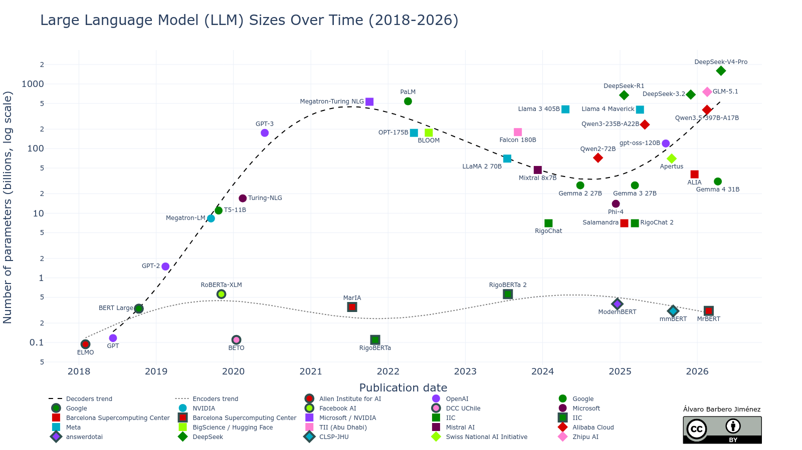

# Large Language Model sizes over time

A small repo with data about some relevant LLMs and a script to generate a plot of publication date VS number of parameters.

**Usage**: you are free to use this plot in your presentations, as long as you cite this repo and its author:
> Large Language Model sizes over time: Álvaro Barbero Jiménez, https://github.com/albarji/llm-sizes-chart
